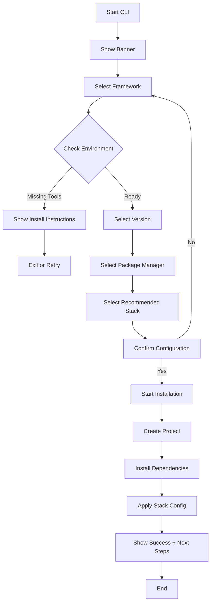
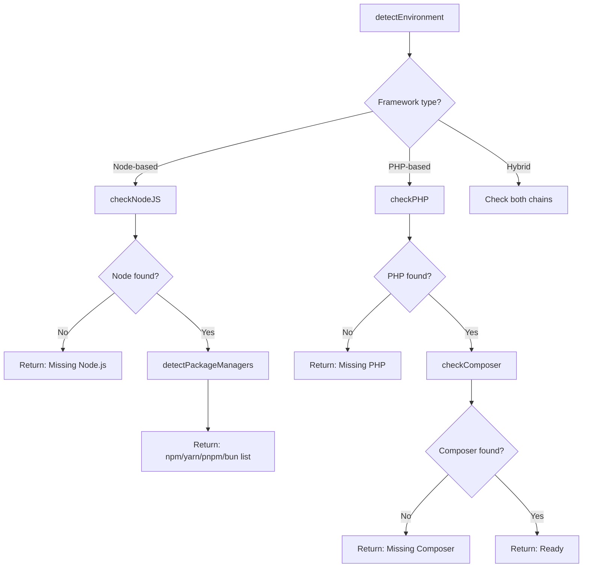

# 🛠️ Architecture Breakdown: Universal CLI Generator

**Untuk:** TOPIC_001 - Universal Project Generator CLI
**Tanggal:** 2024-12-24
**Status:** 🔬 Research Complete

---

## 📚 Library Research Summary

### 🎨 Visual & Styling Layer

| Library             | Purpose                                     | Size  | Recommendation                   |
| :------------------ | :------------------------------------------ | :---- | :------------------------------- |
| **chalk**           | Terminal string styling (colors, bold, etc) | ~5KB  | ✅ **Wajib** - Industry standard |
| **gradient-string** | Gradient color untuk text                   | ~3KB  | ✅ **Wajib** - Untuk banner      |
| **figlet**          | ASCII Art text generator                    | ~30KB | ✅ **Wajib** - Untuk banner      |
| **boxen**           | Box drawing around text                     | ~5KB  | 🟡 Optional - Untuk framing      |

**Contoh Penggunaan:**

```javascript
import chalk from "chalk";
import gradient from "gradient-string";
import figlet from "figlet";

// Banner dengan gradient
const banner = figlet.textSync("ORBIT CLI");
console.log(gradient.pastel.multiline(banner));

// Styled text
console.log(chalk.bold.green("✓ Ready"));
console.log(chalk.hex("#FF5733").underline("Warning"));
```

---

### ⏳ Loading & Progress Layer

| Library          | Purpose                          | Size | Recommendation                 |
| :--------------- | :------------------------------- | :--- | :----------------------------- |
| **ora**          | Elegant terminal spinners        | ~8KB | ✅ **Wajib** - By sindresorhus |
| **cli-spinners** | Collection of 70+ spinner styles | ~5KB | 🟡 Optional - Extra spinners   |

**Contoh Penggunaan:**

```javascript
import ora from "ora";

const spinner = ora("Installing dependencies...").start();

// Update progress
spinner.text = "Configuring project...";
spinner.color = "yellow";

// Final states
spinner.succeed("Project created successfully!");
spinner.fail("Installation failed");
spinner.warn("Missing optional dependency");
spinner.info("Using default configuration");

// Custom spinner
const custom = ora({
  text: "Processing",
  spinner: {
    frames: ["◐", "◓", "◑", "◒"],
    interval: 100,
  },
}).start();
```

---

### 💬 Interactive Prompts Layer

| Library               | Purpose                   | Size  | Recommendation                              |
| :-------------------- | :------------------------ | :---- | :------------------------------------------ |
| **@clack/prompts**    | Modern, beautiful prompts | ~4KB  | ✅ **Pilihan Utama** - Modern & lightweight |
| **@inquirer/prompts** | Classic prompts (modular) | ~15KB | 🟡 Alternative - More mature                |
| **enquirer**          | Feature-rich prompts      | ~12KB | 🟡 Alternative - AutoComplete               |

**Rekomendasi: `@clack/prompts`** karena:

- Desain paling modern & aesthetic
- API simple dan clean
- Sudah termasuk spinner built-in
- Lightweight (4KB gzipped)

**Contoh Penggunaan:**

```javascript
import * as p from "@clack/prompts";

// Intro dengan styling
p.intro(gradient.pastel("Welcome to ORBIT CLI"));

// Select framework
const framework = await p.select({
  message: "Which framework?",
  options: [
    { value: "nextjs", label: "Next.js", hint: "React framework" },
    { value: "nuxt", label: "Nuxt", hint: "Vue framework" },
    { value: "astro", label: "Astro", hint: "Content-focused" },
    { value: "laravel", label: "Laravel", hint: "PHP framework" },
  ],
});

// Multi-select untuk dependencies
const deps = await p.multiselect({
  message: "Select recommended stack:",
  options: [
    { value: "typescript", label: "TypeScript" },
    { value: "eslint", label: "ESLint" },
    { value: "prettier", label: "Prettier" },
    { value: "tailwind", label: "TailwindCSS" },
  ],
});

// Confirm
const proceed = await p.confirm({
  message: "Ready to create project?",
});

// Spinner untuk proses
const s = p.spinner();
s.start("Creating project structure...");
// ... async work
s.stop("Project created!");

p.outro("Happy coding! 🚀");
```

---

### 🔧 CLI Framework Layer

| Library          | Purpose                    | Size  | Recommendation                   |
| :--------------- | :------------------------- | :---- | :------------------------------- |
| **commander.js** | Command & argument parsing | ~10KB | ✅ **Wajib** - Industry standard |

**Catatan:** Untuk aplikasi kita yang lebih interaktif, commander hanya untuk entry point parsing. Mayoritas logika ada di interactive prompts.

```javascript
import { Command } from "commander";

const program = new Command();

program
  .name("orbit")
  .description("Universal Project Generator")
  .version("1.0.0");

program
  .command("create")
  .description("Create a new project")
  .argument("[name]", "Project name")
  .option("-t, --template <template>", "Use specific template")
  .action(async (name, options) => {
    // Launch interactive mode
    await startInteractiveMode(name, options);
  });

program.parse();
```

---

## 🏗️ Application Architecture

> 📂 **Lihat struktur folder lengkap di section [⚡ Performance Optimization](#-performance-optimization)** — sudah dioptimasi untuk lazy loading dan fast startup.

---

## 🔄 Application Flow

### Main Flow Diagram (Mermaid)



---

## 📋 Use Cases

### UC-01: Create New Next.js Project

| Aspect           | Description                                                                                                                                                                                                |
| :--------------- | :--------------------------------------------------------------------------------------------------------------------------------------------------------------------------------------------------------- |
| **Actor**        | Developer                                                                                                                                                                                                  |
| **Precondition** | Node.js & npm/yarn/bun installed                                                                                                                                                                           |
| **Main Flow**    | 1. Run `orbit create`<br>2. Select "Next.js"<br>3. System checks Node.js ✓<br>4. Select version (14/15)<br>5. Select PM (npm/bun)<br>6. Select stack (TypeScript, Tailwind, ESLint)<br>7. Confirm & create |
| **Output**       | Ready-to-use Next.js project                                                                                                                                                                               |

### UC-02: Create Laravel Project (Missing Composer)

| Aspect           | Description                                                                                                                                                                                                   |
| :--------------- | :------------------------------------------------------------------------------------------------------------------------------------------------------------------------------------------------------------ |
| **Actor**        | Developer                                                                                                                                                                                                     |
| **Precondition** | PHP installed, Composer NOT installed                                                                                                                                                                         |
| **Main Flow**    | 1. Run `orbit create`<br>2. Select "Laravel"<br>3. System checks PHP ✓, Composer ✗<br>4. Show: "Composer not found"<br>5. Show install instructions for OS<br>6. User installs Composer<br>7. Retry → Success |
| **Output**       | Clear guidance, no cryptic errors                                                                                                                                                                             |

### UC-03: Quick Create with Template

| Aspect        | Description                                                                                                                                      |
| :------------ | :----------------------------------------------------------------------------------------------------------------------------------------------- |
| **Actor**     | Developer                                                                                                                                        |
| **Main Flow** | 1. Run `orbit create my-app -t nextjs-full`<br>2. Skip framework selection<br>3. Use predefined "nextjs-full" stack<br>4. Direct to installation |
| **Output**    | Fast project creation                                                                                                                            |

---

## 🔍 Activity Diagram: Environment Detection



---

## 📦 Recommended Stack Definitions

### Next.js Stacks

| Stack Name     | Included Packages                             | Command Base                 |
| :------------- | :-------------------------------------------- | :--------------------------- |
| **minimal**    | TypeScript only                               | `npx create-next-app@latest` |
| **standard**   | TypeScript, ESLint, Prettier                  | + `--ts --eslint`            |
| **full**       | TypeScript, ESLint, Prettier, Tailwind, Husky | + `--tailwind`               |
| **enterprise** | + Jest, Playwright, Storybook, Docker         | Custom setup                 |

### Laravel Stacks

| Stack Name    | Included Packages                 | Command Base                              |
| :------------ | :-------------------------------- | :---------------------------------------- |
| **minimal**   | Default Laravel                   | `composer create-project laravel/laravel` |
| **breeze**    | Laravel Breeze (auth scaffolding) | + `php artisan breeze:install`            |
| **jetstream** | Laravel Jetstream (advanced auth) | + `php artisan jetstream:install`         |
| **api**       | Sanctum, API resources            | + `--api` flag                            |
| **full**      | Breeze + Pest + Pint + Actions    | Custom setup                              |

### SvelteKit Stacks

| Stack Name     | Included Packages                              | Command Base        |
| :------------- | :--------------------------------------------- | :------------------ |
| **minimal**    | Default SvelteKit                              | `npx sv create`     |
| **standard**   | TypeScript, ESLint, Prettier                   | Interactive prompts |
| **full**       | TypeScript, ESLint, Prettier, Tailwind, Vitest | + add integrations  |
| **enterprise** | + Playwright, Docker, Drizzle ORM              | Custom setup        |

**SvelteKit Create Command:**

```bash
npx sv create my-app
cd my-app
npm install
npm run dev
```

### Nuxt Stacks

| Stack Name     | Included Packages                           | Command Base    |
| :------------- | :------------------------------------------ | :-------------- |
| **minimal**    | Default Nuxt 3                              | `npx nuxi init` |
| **standard**   | TypeScript, ESLint, Prettier, Nuxt DevTools | + modules       |
| **full**       | + Tailwind, Pinia, VueUse, NuxtUI           | + `@nuxt/ui`    |
| **enterprise** | + Auth, i18n, Image, SEO, Vitest            | Custom setup    |

**Nuxt Popular Modules:**

- `@nuxt/ui` - UI component library
- `@nuxt/image` - Image optimization
- `@nuxtjs/i18n` - Internationalization
- `@pinia/nuxt` - State management
- `@vueuse/nuxt` - Composition utilities

**Nuxt Create Command:**

```bash
npx nuxi init my-app
cd my-app
npm install
npm run dev
```

### Astro Stacks

| Stack Name    | Included Packages                      | Command Base              |
| :------------ | :------------------------------------- | :------------------------ |
| **minimal**   | Default Astro                          | `npm create astro@latest` |
| **blog**      | Astro + Markdown/MDX support           | + `--template blog`       |
| **full**      | TypeScript, Tailwind, React/Vue/Svelte | + integrations            |
| **starlight** | Documentation site preset              | + `--template starlight`  |

**Astro Integrations:**

```bash
# Add integrations via CLI
npx astro add react
npx astro add tailwind
npx astro add mdx
```

**Astro Create Command:**

```bash
npm create astro@latest my-app
cd my-app
npm run dev
```

### Vue Stacks

| Stack Name     | Included Packages                     | Command Base            |
| :------------- | :------------------------------------ | :---------------------- |
| **minimal**    | Vue 3 with Vite                       | `npm create vue@latest` |
| **standard**   | TypeScript, Vue Router, Pinia, ESLint | Interactive prompts     |
| **full**       | + Vitest, Cypress, Prettier, DevTools | All options             |
| **enterprise** | + VueUse, Vee-Validate, i18n          | Custom setup            |

**Vue Create Command:**

```bash
npm create vue@latest my-app
# or legacy
vue create my-app
```

### Remix Stacks (Official)

| Stack Name | Description                                  | Database   | Deploy Target |
| :--------- | :------------------------------------------- | :--------- | :------------ |
| **Blues**  | Large-scale production apps, edge deployment | PostgreSQL | Fly.io Edge   |
| **Indie**  | Dynamic websites with persistent storage     | SQLite     | Fly.io Node   |
| **Grunge** | Serverless deployment on AWS                 | DynamoDB   | AWS Lambda    |

**Remix Community Stacks:**

- **Epic Stack** (Kent C. Dodds) - Full-featured production stack
- **Supa Fly Stack** - Supabase + Fly.io
- **TRANCE Stack** - AWS Lambda optimized

**Remix Create Command:**

```bash
npx create-remix@latest
# With specific stack
npx create-remix@latest --template remix-run/blues-stack
```

---

## ⚡ Performance Optimization

### 🚀 Module Structure (Optimized for Speed)

```
orbit-cli/
├── package.json
├── tsconfig.json
├── tsup.config.ts          # Fast bundling with esbuild
│
├── src/
│   ├── index.ts            # Minimal entry - just commander setup
│   ├── cli.ts              # Main flow (lazy loaded)
│   │
│   ├── ui/                 # UI Components (lazy loaded)
│   │   ├── index.ts        # Re-exports
│   │   ├── banner.ts       # ASCII banner + gradient
│   │   ├── prompts.ts      # Clack prompts wrapper
│   │   └── spinner.ts      # Ora spinner wrapper
│   │
│   ├── core/               # Core Logic (lazy loaded per-command)
│   │   ├── index.ts
│   │   ├── detector.ts     # Environment detection
│   │   ├── installer.ts    # Package installation
│   │   └── executor.ts     # Command execution (child_process)
│   │
│   ├── frameworks/         # Framework Configs (lazy loaded)
│   │   ├── index.ts        # Registry with dynamic imports
│   │   ├── types.ts        # Shared types (sync import)
│   │   ├── nextjs/
│   │   │   ├── index.ts
│   │   │   └── stacks.ts
│   │   ├── nuxt/
│   │   │   ├── index.ts
│   │   │   └── stacks.ts
│   │   ├── astro/
│   │   │   ├── index.ts
│   │   │   └── stacks.ts
│   │   ├── svelte/
│   │   │   ├── index.ts
│   │   │   └── stacks.ts
│   │   ├── vue/
│   │   │   ├── index.ts
│   │   │   └── stacks.ts
│   │   ├── remix/
│   │   │   ├── index.ts
│   │   │   └── stacks.ts
│   │   └── laravel/
│   │       ├── index.ts
│   │       └── stacks.ts
│   │
│   └── utils/              # Utilities (minimal sync imports)
│       ├── system.ts       # System checks
│       ├── pm.ts           # Package manager detection
│       └── logger.ts       # Lightweight logging
│
├── dist/                   # Bundled output (single file)
│   └── index.mjs           # ESM bundle
│
└── bin/
    └── orbit.js            # CLI entry with shebang
```

### 🔧 Performance Strategies

#### 1. Lazy Loading (Dynamic Imports)

```typescript
// ❌ BAD: Semua library di-load saat startup
import chalk from "chalk";
import ora from "ora";
import figlet from "figlet";
import gradient from "gradient-string";

// ✅ GOOD: Load hanya saat dibutuhkan
async function showBanner() {
  const [{ default: figlet }, { default: gradient }] = await Promise.all([
    import("figlet"),
    import("gradient-string"),
  ]);

  const banner = figlet.textSync("ORBIT CLI");
  console.log(gradient.pastel.multiline(banner));
}

// Framework configs juga lazy loaded
async function loadFramework(name: string) {
  const module = await import(`./frameworks/${name}/index.ts`);
  return module.default;
}
```

#### 2. Minimal Entry Point

```typescript
// src/index.ts - HANYA parsing, tidak ada heavy imports
import { Command } from "commander";

const program = new Command();

program
  .name("orbit")
  .version("1.0.0")
  .command("create [name]")
  .action(async (name) => {
    // Lazy load main CLI flow
    const { startInteractiveMode } = await import("./cli.js");
    await startInteractiveMode(name);
  });

program.parse();
```

#### 3. Bundling dengan tsup (esbuild)

```typescript
// tsup.config.ts
import { defineConfig } from "tsup";

export default defineConfig({
  entry: ["src/index.ts"],
  format: ["esm"], // ESM only for modern Node
  target: "node18", // Target Node 18+
  splitting: false, // Single bundle file
  clean: true,
  minify: true, // Minify for smaller size
  treeshake: true, // Remove unused code
  dts: false, // No need for CLI
  banner: {
    js: "#!/usr/bin/env node",
  },
});
```

#### 4. NODE_COMPILE_CACHE (Node 22+)

```bash
# Enable V8 bytecode caching untuk startup lebih cepat
export NODE_COMPILE_CACHE=~/.cache/orbit-cli
orbit create
```

#### 5. Defer Heavy Operations

```typescript
// Spinner dimulai SEBELUM heavy operations
const s = spinner();
s.start("Checking environment...");

// Heavy check dilakukan setelah spinner tampil
const env = await detectEnvironment();
s.stop("Environment ready");
```

### 📊 Expected Performance Gains

| Optimization         | Impact               |
| :------------------- | :------------------- |
| Lazy loading         | -40% startup time    |
| Single bundle (tsup) | -30% load time       |
| Tree-shaking         | -20% bundle size     |
| Compile cache        | -50% subsequent runs |

### 📏 Target Metrics

| Metric       | Target  | Reason                 |
| :----------- | :------ | :--------------------- |
| Cold start   | < 200ms | Instant feel           |
| Warm start   | < 100ms | With compile cache     |
| Bundle size  | < 500KB | Fast npm install       |
| Dependencies | < 10    | Minimal attack surface |

---

## 🔧 Technical Decisions

### 1. TypeScript vs JavaScript

**Decision:** TypeScript
**Reason:** Better maintainability, autocomplete, type safety untuk framework configs.

### 2. ESM vs CommonJS

**Decision:** ESM (ES Modules)
**Reason:** Modern standard, native async/await, smaller bundle, better tree-shaking.

### 3. Prompt Library: @clack/prompts vs Inquirer

**Decision:** @clack/prompts
**Reason:**

- More aesthetic out-of-the-box
- Smaller bundle size (4KB vs 15KB)
- Built-in spinner
- Modern API design

### 4. Bundler for Distribution

**Decision:** tsup (powered by esbuild)
**Reason:** Fast build, ESM output, simple config, tree-shaking.

### 5. Lazy Loading Strategy

**Decision:** Dynamic imports untuk semua non-critical modules
**Reason:** Minimize cold start time, load hanya yang dibutuhkan.

---

## 📚 References

| Source          | URL                                      |
| :-------------- | :--------------------------------------- |
| Chalk           | https://github.com/chalk/chalk           |
| Ora             | https://github.com/sindresorhus/ora      |
| @clack/prompts  | https://github.com/bombshell-dev/clack   |
| Commander.js    | https://github.com/tj/commander.js       |
| Figlet          | https://github.com/patorjk/figlet.js     |
| Gradient-string | https://github.com/bokub/gradient-string |
| SvelteKit       | https://svelte.dev/docs/kit              |
| Nuxt            | https://nuxt.com/docs                    |
| Astro           | https://docs.astro.build                 |
| Vue CLI         | https://cli.vuejs.org                    |
| Remix           | https://remix.run/docs                   |
| tsup            | https://github.com/egoist/tsup           |
