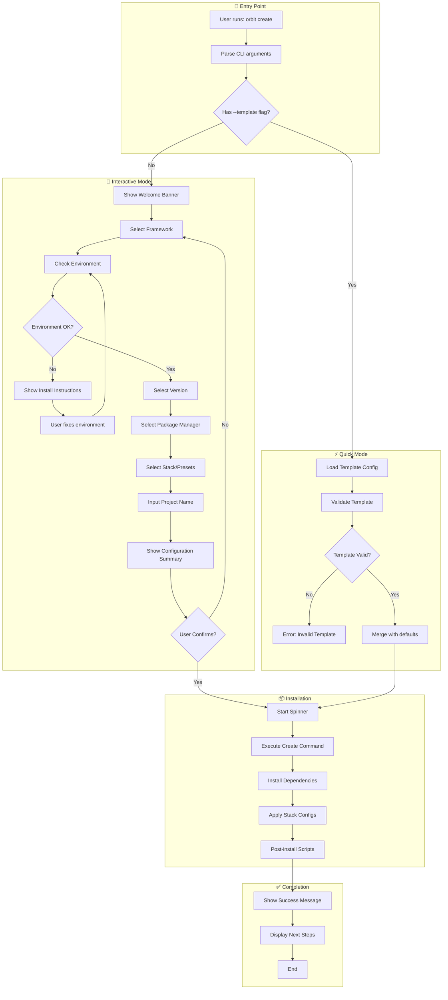
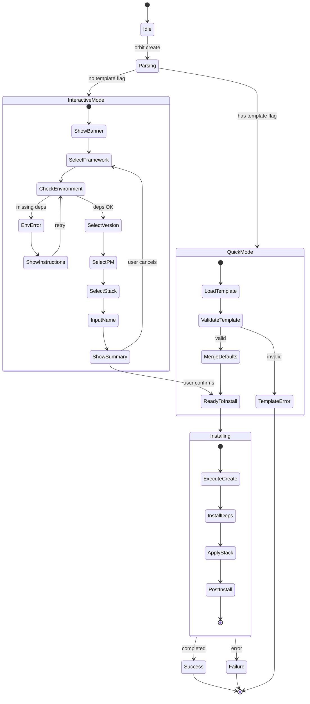
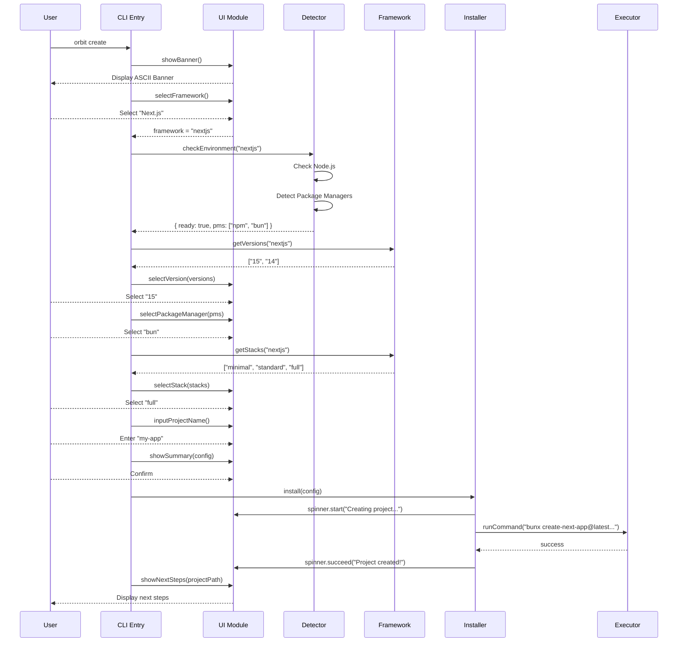
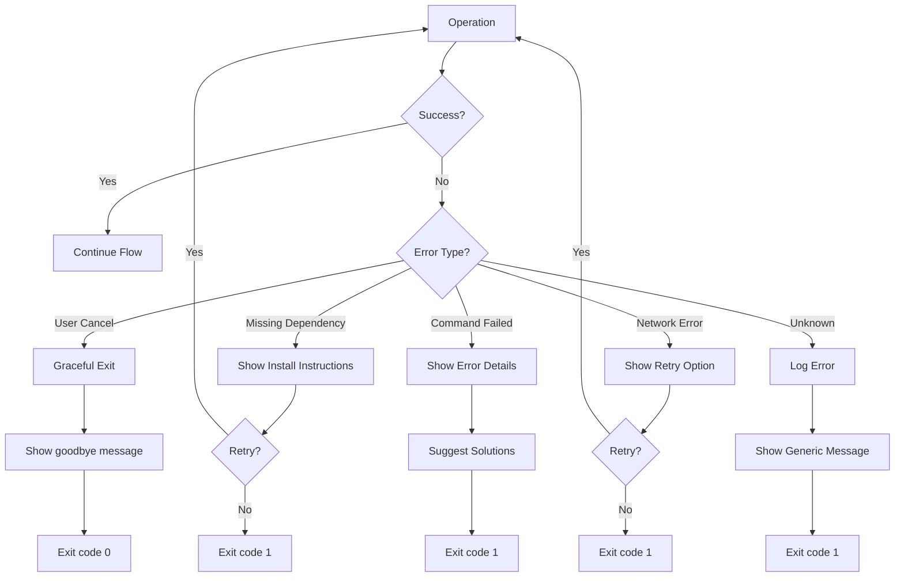
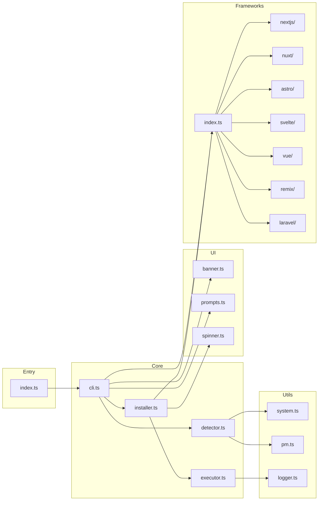

# Workflow & Application Flow

**Parent:** [← Kembali ke Main](_main.md)
**Status:** ✅ Created

---

## 1. High-Level Workflow



---

## 2. Command Structure

### Primary Commands

| Command                             | Description                       | Example                              |
| :---------------------------------- | :-------------------------------- | :----------------------------------- |
| `orbit create [name]`               | Create new project (interactive)  | `orbit create my-app`                |
| `orbit create [name] -t <template>` | Create with template (quick mode) | `orbit create my-app -t nextjs-full` |
| `orbit list`                        | List available frameworks         | `orbit list`                         |
| `orbit list <framework>`            | List stacks for framework         | `orbit list nextjs`                  |
| `orbit doctor`                      | Check system environment          | `orbit doctor`                       |
| `orbit --version`                   | Show version                      | `orbit -V`                           |
| `orbit --help`                      | Show help                         | `orbit -h`                           |

### Command Options

```typescript
interface CreateOptions {
  template?: string; // -t, --template <name>
  packageManager?: string; // -p, --pm <npm|yarn|pnpm|bun>
  skipInstall?: boolean; // --skip-install
  git?: boolean; // --git / --no-git
  yes?: boolean; // -y, --yes (use defaults)
}
```

---

## 3. State Machine: Create Flow



---

## 4. Sequence Diagram: Interactive Create



---

## 5. Error Handling Flow



---

## 6. Module Interaction Map


