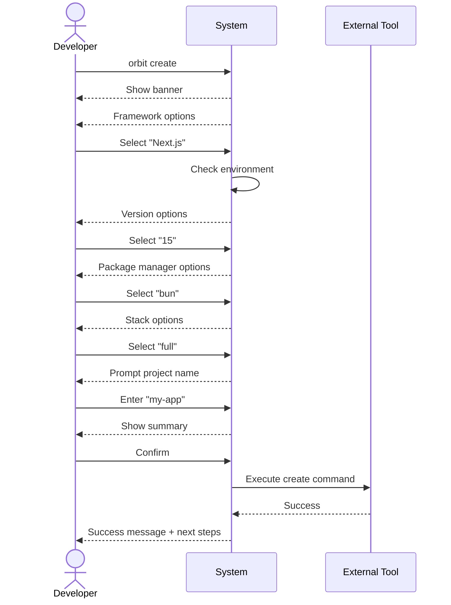
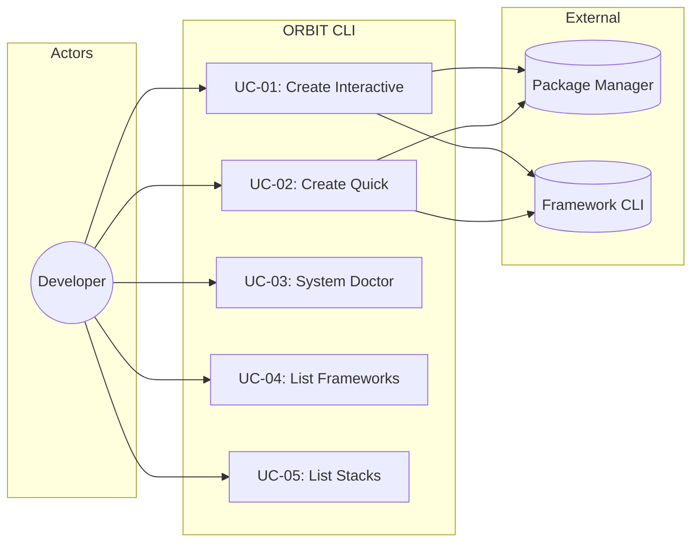

# Use Cases Detail

**Parent:** [← Kembali ke Main](_main.md)
**Status:** ✅ Created

---

## Actors

| Actor               | Description                                  |
| :------------------ | :------------------------------------------- |
| **Developer**       | Primary user yang ingin membuat project baru |
| **System**          | ORBIT CLI application                        |
| **External Tool**   | Framework CLI (create-next-app, nuxi, etc.)  |
| **Package Manager** | npm, yarn, pnpm, bun                         |

---

## UC-01: Create Project (Interactive Mode)

### Overview

| Field          | Value                      |
| :------------- | :------------------------- |
| **ID**         | UC-01                      |
| **Name**       | Create Project Interactive |
| **Actor**      | Developer                  |
| **Priority**   | 🔴 Critical (MVP)          |
| **Complexity** | High                       |

### Preconditions

1. ORBIT CLI terinstall (`npm i -g orbit-cli`)
2. Terminal mendukung ANSI colors
3. Internet connection (untuk download dependencies)

### Postconditions

1. Project folder dibuat dengan nama yang ditentukan
2. Dependencies terinstall
3. Stack configurations applied
4. Git initialized (jika dipilih)

### Main Flow

```
1. Developer menjalankan `orbit create`
2. System menampilkan welcome banner (ASCII art + gradient)
3. System menampilkan list framework yang tersedia
4. Developer memilih framework (e.g., "Next.js")
5. System mengecek environment untuk framework tersebut
6. System menampilkan list versi yang tersedia
7. Developer memilih versi (e.g., "15")
8. System menampilkan list package manager yang terdeteksi
9. Developer memilih package manager (e.g., "bun")
10. System menampilkan list stack presets
11. Developer memilih stack (e.g., "full")
12. System meminta nama project
13. Developer memasukkan nama project (e.g., "my-app")
14. System menampilkan configuration summary
15. Developer mengkonfirmasi
16. System menjalankan instalasi dengan spinner
17. System menampilkan success message dan next steps
```

### Alternative Flows

**AF-01: Environment Not Ready**

```
5a. System mendeteksi dependency yang hilang
5b. System menampilkan instruksi instalasi yang jelas
5c. Developer menginstall dependency
5d. Developer memilih "Retry"
5e. Kembali ke langkah 5
```

**AF-02: User Cancels During Selection**

```
*a. Developer menekan Ctrl+C atau memilih "Cancel"
*b. System menampilkan goodbye message
*c. System exits dengan code 0
```

**AF-03: Installation Fails**

```
16a. External tool command fails
16b. System menampilkan error message dengan detail
16c. System menyarankan solusi (check logs, retry, etc.)
16d. System exits dengan code 1
```

### Sequence Diagram



---

## UC-02: Create Project (Quick Mode)

### Overview

| Field          | Value                        |
| :------------- | :--------------------------- |
| **ID**         | UC-02                        |
| **Name**       | Create Project with Template |
| **Actor**      | Developer                    |
| **Priority**   | 🟡 High                      |
| **Complexity** | Medium                       |

### Preconditions

1. ORBIT CLI terinstall
2. Template name valid dan terdaftar

### Main Flow

```
1. Developer menjalankan `orbit create my-app -t nextjs-full`
2. System memparse arguments
3. System memvalidasi template "nextjs-full"
4. System mengecek environment untuk Next.js
5. System menjalankan instalasi dengan spinner
6. System menampilkan success message
```

### Alternative Flows

**AF-01: Invalid Template**

```
3a. Template tidak ditemukan
3b. System menampilkan error dengan daftar template valid
3c. System exits dengan code 1
```

---

## UC-03: Check System Environment

### Overview

| Field          | Value         |
| :------------- | :------------ |
| **ID**         | UC-03         |
| **Name**       | System Doctor |
| **Actor**      | Developer     |
| **Priority**   | 🟢 Normal     |
| **Complexity** | Low           |

### Main Flow

```
1. Developer menjalankan `orbit doctor`
2. System mengecek Node.js version
3. System mengecek npm/yarn/pnpm/bun availability
4. System mengecek PHP version (jika ada)
5. System mengecek Composer (jika PHP ada)
6. System menampilkan report dengan status per tool
```

### Output Example

```
🩺 ORBIT CLI System Check

  Node.js      v20.10.0   ✅ Ready
  npm          v10.2.5    ✅ Ready
  yarn         v1.22.19   ✅ Ready
  pnpm         v8.12.0    ✅ Ready
  bun          v1.0.21    ✅ Ready
  PHP          v8.3.0     ✅ Ready
  Composer     v2.6.5     ✅ Ready

✅ All systems ready!
```

---

## UC-04: List Available Frameworks

### Overview

| Field          | Value           |
| :------------- | :-------------- |
| **ID**         | UC-04           |
| **Name**       | List Frameworks |
| **Actor**      | Developer       |
| **Priority**   | 🟢 Normal       |
| **Complexity** | Low             |

### Main Flow

```
1. Developer menjalankan `orbit list`
2. System menampilkan daftar framework yang didukung
```

### Output Example

```
📦 Available Frameworks

  Framework     Stacks    Environment
  ─────────────────────────────────────
  Next.js       4         Node.js
  Nuxt          4         Node.js
  Astro         4         Node.js
  SvelteKit     4         Node.js
  Vue           4         Node.js
  Remix         3         Node.js
  Laravel       5         PHP

Total: 7 frameworks
```

---

## UC-05: List Framework Stacks

### Overview

| Field          | Value       |
| :------------- | :---------- |
| **ID**         | UC-05       |
| **Name**       | List Stacks |
| **Actor**      | Developer   |
| **Priority**   | 🟢 Normal   |
| **Complexity** | Low         |

### Main Flow

```
1. Developer menjalankan `orbit list nextjs`
2. System menampilkan stacks untuk Next.js
```

### Output Example

```
📦 Next.js Stacks

  Stack          Includes
  ───────────────────────────────────────────
  minimal        TypeScript
  standard       TypeScript, ESLint, Prettier
  full           TypeScript, ESLint, Prettier, Tailwind, Husky
  enterprise     + Jest, Playwright, Storybook, Docker

Use: orbit create my-app -t nextjs-<stack>
```

---

## Use Case Diagram



---

## Use Case Priority Matrix

| Use Case | Priority    | MVP | Effort | Value  |
| :------- | :---------- | :-- | :----- | :----- |
| UC-01    | 🔴 Critical | ✅  | High   | High   |
| UC-02    | 🟡 High     | ✅  | Medium | High   |
| UC-03    | 🟢 Normal   | ✅  | Low    | Medium |
| UC-04    | 🟢 Normal   | ✅  | Low    | Medium |
| UC-05    | 🟢 Normal   | ✅  | Low    | Medium |
