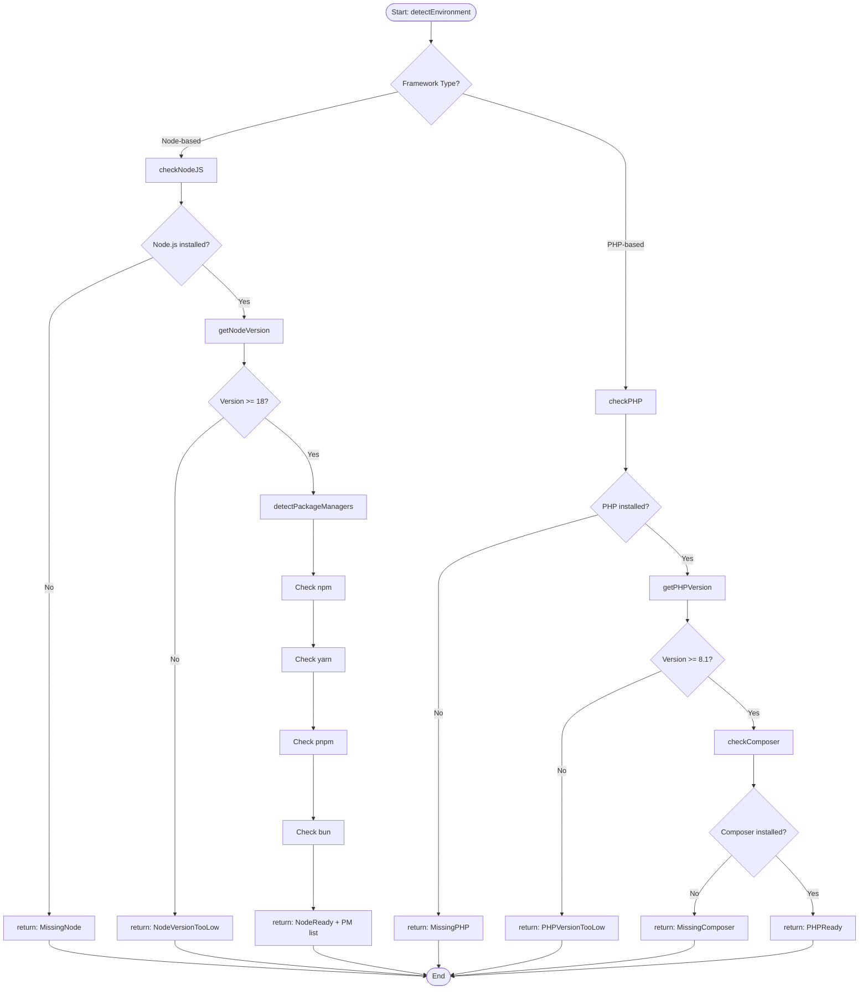
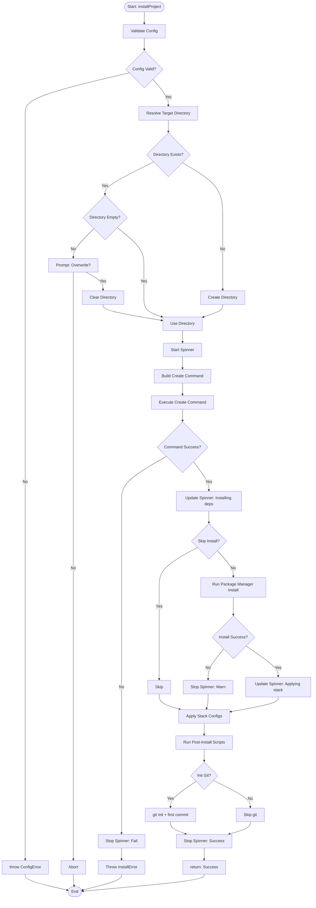
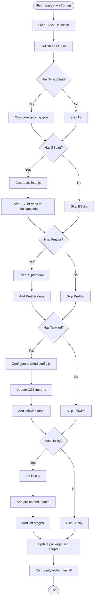
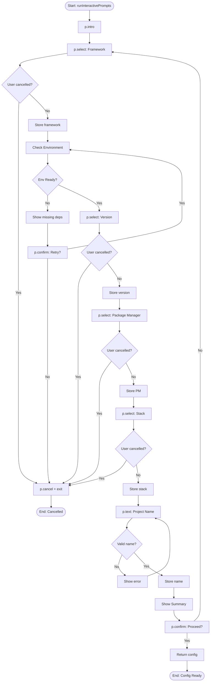
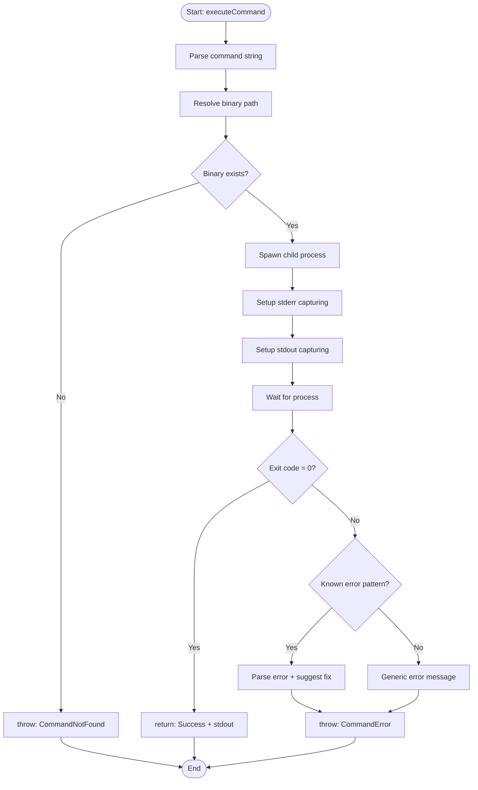

# Activity Diagrams

**Parent:** [← Kembali ke Main](_main.md)
**Status:** ✅ Created

---

## AD-01: Environment Detection

### Description

Proses deteksi environment berdasarkan framework yang dipilih.

### Diagram



### Pseudocode

```typescript
async function detectEnvironment(framework: Framework): Promise<EnvResult> {
  const type = framework.environmentType;

  if (type === "node" || type === "hybrid") {
    const nodeCheck = await checkNodeJS();
    if (!nodeCheck.installed) {
      return {
        ready: false,
        missing: "Node.js",
        instructions: getNodeInstructions(),
      };
    }
    if (nodeCheck.version < "18.0.0") {
      return { ready: false, error: "NodeVersionTooLow", required: ">=18.0.0" };
    }
    const pms = await detectPackageManagers();
    if (pms.length === 0) {
      return {
        ready: false,
        missing: "PackageManager",
        instructions: getNpmInstructions(),
      };
    }
  }

  if (type === "php" || type === "hybrid") {
    const phpCheck = await checkPHP();
    if (!phpCheck.installed) {
      return {
        ready: false,
        missing: "PHP",
        instructions: getPHPInstructions(),
      };
    }
    if (phpCheck.version < "8.1.0") {
      return { ready: false, error: "PHPVersionTooLow", required: ">=8.1.0" };
    }
    const composerCheck = await checkComposer();
    if (!composerCheck.installed) {
      return {
        ready: false,
        missing: "Composer",
        instructions: getComposerInstructions(),
      };
    }
  }

  return { ready: true, packageManagers: pms };
}
```

---

## AD-02: Project Installation

### Description

Proses instalasi project dari awal sampai selesai.

### Diagram



### Pseudocode

```typescript
async function installProject(config: ProjectConfig): Promise<InstallResult> {
  // Validate
  validateConfig(config);

  // Resolve directory
  const targetDir = path.resolve(config.projectName);
  await ensureDirectoryEmpty(targetDir);

  // Start installation
  const spinner = ora().start("Creating project...");

  try {
    // Build and execute create command
    const command = buildCreateCommand(config);
    await executor.run(command, { cwd: process.cwd() });

    // Install dependencies
    if (!config.skipInstall) {
      spinner.text = "Installing dependencies...";
      await executor.run(`${config.packageManager} install`, {
        cwd: targetDir,
      });
    }

    // Apply stack configurations
    spinner.text = "Applying stack configurations...";
    await applyStackConfigs(config.stack, targetDir);

    // Post-install scripts
    await runPostInstallScripts(config.framework, targetDir);

    // Git init
    if (config.git) {
      await executor.run("git init", { cwd: targetDir });
      await executor.run("git add .", { cwd: targetDir });
      await executor.run('git commit -m "Initial commit via ORBIT CLI"', {
        cwd: targetDir,
      });
    }

    spinner.succeed("Project created successfully!");
    return { success: true, path: targetDir };
  } catch (error) {
    spinner.fail("Installation failed");
    throw new InstallError(error);
  }
}
```

---

## AD-03: Stack Configuration Apply

### Description

Proses aplikasi stack configuration ke project yang baru dibuat.

### Diagram



---

## AD-04: Interactive Prompt Flow

### Description

Alur interactive prompts untuk mengumpulkan user input.

### Diagram



---

## AD-05: Command Execution

### Description

Proses eksekusi shell command dengan error handling.

### Diagram



### Pseudocode

```typescript
async function executeCommand(
  command: string,
  options: ExecOptions
): Promise<ExecResult> {
  const [binary, ...args] = command.split(" ");

  // Check if binary exists
  const binaryPath = await which(binary).catch(() => null);
  if (!binaryPath) {
    throw new CommandNotFoundError(binary);
  }

  return new Promise((resolve, reject) => {
    const child = spawn(binary, args, {
      cwd: options.cwd,
      stdio: ["inherit", "pipe", "pipe"],
      env: { ...process.env, ...options.env },
    });

    let stdout = "";
    let stderr = "";

    child.stdout.on("data", (data) => {
      stdout += data;
    });
    child.stderr.on("data", (data) => {
      stderr += data;
    });

    child.on("close", (code) => {
      if (code === 0) {
        resolve({ success: true, stdout, stderr });
      } else {
        const error = parseKnownError(stderr) || new CommandError(stderr);
        reject(error);
      }
    });

    child.on("error", (err) => {
      reject(new CommandError(err.message));
    });
  });
}
```
