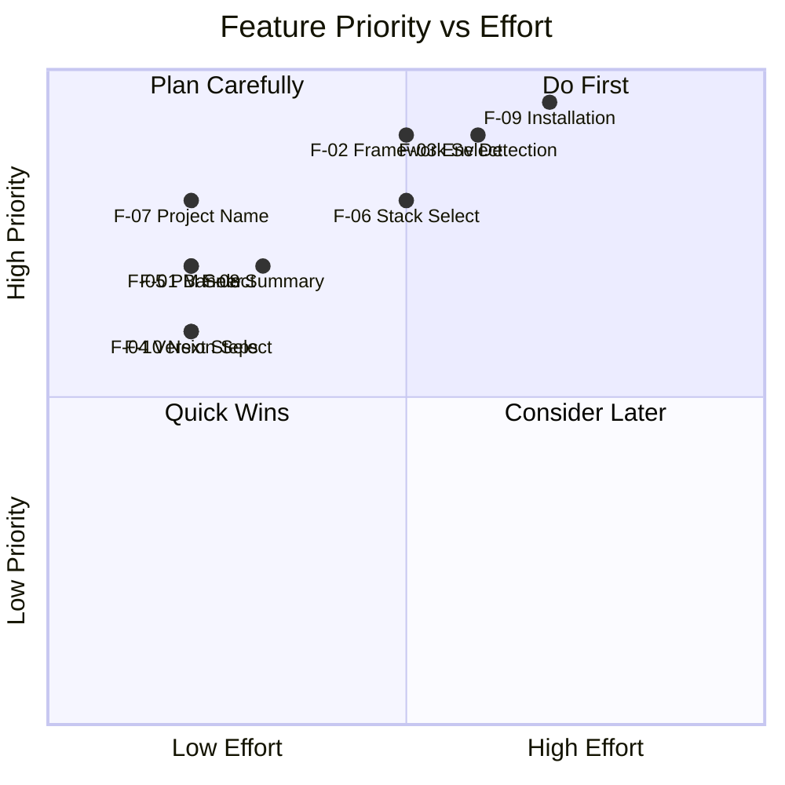

# Core Features & MVP

**Parent:** [← Kembali ke Main](_main.md)
**Status:** ✅ Created

---

## MVP Definition

### Scope

MVP (Minimum Viable Product) fokus pada:

1. ✅ Create project via interactive mode
2. ✅ Support 3 frameworks: Next.js, Nuxt, Astro
3. ✅ Basic stack presets (minimal, standard, full)
4. ✅ Environment detection
5. ✅ Beautiful UI (banner, spinners, prompts)

### Out of Scope (Post-MVP)

- ❌ Laravel/PHP support (Phase 2)
- ❌ Custom template creation
- ❌ Plugin system
- ❌ Configuration file (~/.orbitrc)
- ❌ Update notifications

---

## Feature Breakdown

### F-01: Welcome Banner

| Field            | Value                   |
| :--------------- | :---------------------- |
| **Priority**     | 🔴 MVP                  |
| **Effort**       | Low                     |
| **Dependencies** | figlet, gradient-string |

**Description:**
ASCII art banner dengan gradient coloring yang ditampilkan saat CLI dimulai.

**Acceptance Criteria:**

- [ ] Banner menggunakan font "ANSI Shadow" atau serupa
- [ ] Gradient warna pastel/atlas
- [ ] Ditampilkan hanya di interactive mode
- [ ] Tidak ditampilkan jika terminal tidak support colors

**Implementation:**

```typescript
// src/ui/banner.ts
export async function showBanner(): Promise<void> {
  const [{ default: figlet }, { default: gradient }] = await Promise.all([
    import("figlet"),
    import("gradient-string"),
  ]);

  const text = figlet.textSync("ORBIT", { font: "ANSI Shadow" });
  console.log(gradient.atlas.multiline(text));
  console.log();
}
```

---

### F-02: Framework Selection

| Field            | Value                              |
| :--------------- | :--------------------------------- |
| **Priority**     | 🔴 MVP                             |
| **Effort**       | Medium                             |
| **Dependencies** | @clack/prompts, framework registry |

**Description:**
Interactive select prompt untuk memilih framework.

**Acceptance Criteria:**

- [ ] Menampilkan semua framework yang didukung
- [ ] Setiap option punya hint/description
- [ ] Support keyboard navigation (arrow keys)
- [ ] Support search/filter (jika banyak options)

**Implementation:**

```typescript
// src/ui/prompts.ts
export async function selectFramework(): Promise<string> {
  const frameworks = await getFrameworkRegistry();

  const result = await p.select({
    message: "Which framework would you like to use?",
    options: frameworks.map((fw) => ({
      value: fw.id,
      label: fw.name,
      hint: fw.description,
    })),
  });

  if (p.isCancel(result)) {
    p.cancel("Operation cancelled.");
    process.exit(0);
  }

  return result as string;
}
```

---

### F-03: Environment Detection

| Field            | Value                |
| :--------------- | :------------------- |
| **Priority**     | 🔴 MVP               |
| **Effort**       | Medium               |
| **Dependencies** | child_process, which |

**Description:**
Deteksi otomatis apakah environment user siap untuk framework yang dipilih.

**Acceptance Criteria:**

- [ ] Cek Node.js version (>=18)
- [ ] Deteksi package managers tersedia
- [ ] Tampilkan instruksi jelas jika ada yang missing
- [ ] Support retry after user installs

**Implementation:**

```typescript
// src/core/detector.ts
export async function checkEnvironment(
  framework: Framework
): Promise<EnvironmentResult> {
  const results: CheckResult[] = [];

  // Node.js check
  const nodeVersion = await getNodeVersion();
  results.push({
    tool: "Node.js",
    installed: !!nodeVersion,
    version: nodeVersion,
    required: ">=18.0.0",
    ok: nodeVersion && semver.gte(nodeVersion, "18.0.0"),
  });

  // Package manager detection
  const pms = await detectPackageManagers();

  return {
    ready: results.every((r) => r.ok) && pms.length > 0,
    checks: results,
    packageManagers: pms,
    instructions: generateInstructions(results),
  };
}
```

---

### F-04: Version Selection

| Field            | Value          |
| :--------------- | :------------- |
| **Priority**     | 🔴 MVP         |
| **Effort**       | Low            |
| **Dependencies** | @clack/prompts |

**Description:**
Pilihan versi framework (jika framework support multiple versions).

**Acceptance Criteria:**

- [ ] Show latest version sebagai default
- [ ] Tampilkan release date atau LTS status
- [ ] Skip jika hanya 1 versi tersedia

---

### F-05: Package Manager Selection

| Field            | Value                    |
| :--------------- | :----------------------- |
| **Priority**     | 🔴 MVP                   |
| **Effort**       | Low                      |
| **Dependencies** | @clack/prompts, detector |

**Description:**
Pilihan package manager berdasarkan yang terdeteksi.

**Acceptance Criteria:**

- [ ] Hanya tampilkan PM yang terinstall
- [ ] Default ke npm jika tersedia
- [ ] Tampilkan version masing-masing PM

---

### F-06: Stack Selection

| Field            | Value                             |
| :--------------- | :-------------------------------- |
| **Priority**     | 🔴 MVP                            |
| **Effort**       | Medium                            |
| **Dependencies** | @clack/prompts, stack definitions |

**Description:**
Pilihan stack preset dengan deskripsi what's included.

**Acceptance Criteria:**

- [ ] Minimal 3 preset per framework
- [ ] Tampilkan included packages
- [ ] "standard" sebagai default

**Stack Presets:**

```typescript
// src/frameworks/nextjs/stacks.ts
export const nextjsStacks: Stack[] = [
  {
    id: "minimal",
    name: "Minimal",
    description: "TypeScript only",
    includes: ["typescript"],
    createFlags: ["--ts", "--no-eslint", "--no-tailwind"],
    postInstall: [],
  },
  {
    id: "standard",
    name: "Standard",
    description: "TypeScript, ESLint, Prettier",
    includes: ["typescript", "eslint", "prettier"],
    createFlags: ["--ts", "--eslint"],
    postInstall: ["prettier"],
  },
  {
    id: "full",
    name: "Full",
    description: "TypeScript, ESLint, Prettier, Tailwind, Husky",
    includes: ["typescript", "eslint", "prettier", "tailwindcss", "husky"],
    createFlags: ["--ts", "--eslint", "--tailwind"],
    postInstall: ["prettier", "husky", "lint-staged"],
  },
];
```

---

### F-07: Project Name Input

| Field            | Value          |
| :--------------- | :------------- |
| **Priority**     | 🔴 MVP         |
| **Effort**       | Low            |
| **Dependencies** | @clack/prompts |

**Description:**
Text input untuk nama project dengan validasi.

**Acceptance Criteria:**

- [ ] Validasi: lowercase, no spaces, valid npm name
- [ ] Check directory not exists
- [ ] Auto-suggest jika argument sudah diberikan

---

### F-08: Configuration Summary

| Field            | Value          |
| :--------------- | :------------- |
| **Priority**     | 🔴 MVP         |
| **Effort**       | Low            |
| **Dependencies** | @clack/prompts |

**Description:**
Tampilkan ringkasan konfigurasi sebelum proceed.

**Acceptance Criteria:**

- [ ] Tampilkan semua pilihan user
- [ ] Konfirmasi dengan Y/n
- [ ] Option untuk go back

**Output Example:**

```
┌  Configuration Summary
│
│  Framework:     Next.js 15
│  Stack:         full
│  Package Mgr:   bun
│  Project:       my-awesome-app
│  Directory:     /home/user/projects/my-awesome-app
│
└  Press Enter to create, or Ctrl+C to cancel
```

---

### F-09: Installation with Spinner

| Field            | Value              |
| :--------------- | :----------------- |
| **Priority**     | 🔴 MVP             |
| **Effort**       | Medium             |
| **Dependencies** | ora, child_process |

**Description:**
Eksekusi instalasi dengan spinner untuk feedback visual.

**Acceptance Criteria:**

- [ ] Spinner dengan text yang update sesuai progress
- [ ] Handle error dengan spinner.fail()
- [ ] Hide stdout dari external commands
- [ ] Show success dengan spinner.succeed()

---

### F-10: Next Steps Display

| Field            | Value  |
| :--------------- | :----- |
| **Priority**     | 🔴 MVP |
| **Effort**       | Low    |
| **Dependencies** | chalk  |

**Description:**
Tampilkan instruksi next steps setelah project dibuat.

**Acceptance Criteria:**

- [ ] cd ke project directory
- [ ] Run dev server command
- [ ] Open browser URL
- [ ] Optional: link to documentation

**Output Example:**

```
✅ Project created successfully!

   Next steps:

   cd my-awesome-app
   bun dev

   Open http://localhost:3000

   Happy coding! 🚀
```

---

## Feature Priority Matrix



---

## MVP Checklist

### Week 1: Foundation

- [ ] Project setup (TypeScript, tsup, commander)
- [ ] F-01: Banner implementation
- [ ] F-07: Project name input
- [ ] F-08: Configuration summary
- [ ] F-10: Next steps display

### Week 2: Core Logic

- [ ] F-03: Environment detection
- [ ] F-09: Installation with spinner
- [ ] Framework registry structure
- [ ] Executor module

### Week 3: Interactive Flow

- [ ] F-02: Framework selection
- [ ] F-04: Version selection
- [ ] F-05: Package manager selection
- [ ] F-06: Stack selection
- [ ] Wire all prompts together

### Week 4: Frameworks

- [ ] Next.js framework config + stacks
- [ ] Nuxt framework config + stacks
- [ ] Astro framework config + stacks
- [ ] Testing & bug fixes
- [ ] Documentation

---

## Non-Functional Requirements

| Requirement           | Target                | Measurement                           |
| :-------------------- | :-------------------- | :------------------------------------ |
| Cold Start            | < 200ms               | time orbit --help                     |
| Installation Complete | < 60s                 | time orbit create (network dependent) |
| Bundle Size           | < 500KB               | du -h dist/index.mjs                  |
| Dependencies          | < 10                  | npm ls --depth=0                      |
| Node Support          | >= 18.0.0             | engines in package.json               |
| OS Support            | macOS, Linux, Windows | CI tests                              |
