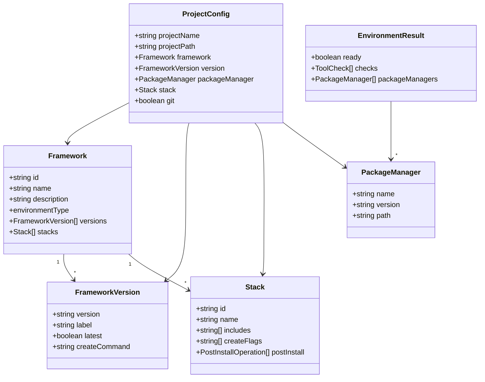

# Data Structures & Types

**Parent:** [← Kembali ke Main](_main.md)
**Status:** ✅ Created

---

## Overview

Dokumen ini mendefinisikan semua TypeScript types dan interfaces yang digunakan dalam ORBIT CLI. Semua types berada di `src/frameworks/types.ts` dan module-specific types.

---

## 1. Framework Types

### Framework Definition

```typescript
// src/frameworks/types.ts

/**
 * Represents a supported framework in ORBIT CLI
 */
export interface Framework {
  /** Unique identifier (e.g., 'nextjs', 'nuxt') */
  id: string;

  /** Display name (e.g., 'Next.js', 'Nuxt') */
  name: string;

  /** Short description */
  description: string;

  /** Environment type required */
  environmentType: "node" | "php" | "hybrid";

  /** Minimum Node.js version (if node-based) */
  minNodeVersion?: string;

  /** Minimum PHP version (if php-based) */
  minPHPVersion?: string;

  /** Available versions */
  versions: FrameworkVersion[];

  /** Available stack presets */
  stacks: Stack[];

  /** Official website */
  website: string;

  /** Documentation URL */
  docs: string;
}

/**
 * Represents a specific version of a framework
 */
export interface FrameworkVersion {
  /** Version number (e.g., '15', '14') */
  version: string;

  /** Display label (e.g., 'Next.js 15 (Latest)') */
  label: string;

  /** Whether this is the latest/recommended version */
  latest: boolean;

  /** LTS status if applicable */
  lts?: boolean;

  /** Release date */
  releaseDate?: string;

  /** Create command template */
  createCommand: string;
}
```

### Stack Definition

```typescript
/**
 * Represents a stack preset for a framework
 */
export interface Stack {
  /** Unique identifier (e.g., 'minimal', 'full') */
  id: string;

  /** Display name */
  name: string;

  /** Description of what's included */
  description: string;

  /** List of included features/packages */
  includes: string[];

  /** Flags to pass to create command */
  createFlags: string[];

  /** Post-install operations */
  postInstall: PostInstallOperation[];
}

/**
 * Represents a post-install operation
 */
export interface PostInstallOperation {
  /** Operation type */
  type: "install" | "script" | "file" | "config";

  /** Operation name for display */
  name: string;

  /** Packages to install (if type = 'install') */
  packages?: string[];

  /** Dev dependency flag */
  dev?: boolean;

  /** Script to run (if type = 'script') */
  script?: string;

  /** File to create (if type = 'file') */
  file?: FileOperation;

  /** Config to merge (if type = 'config') */
  config?: ConfigOperation;
}

export interface FileOperation {
  path: string;
  content: string;
  overwrite?: boolean;
}

export interface ConfigOperation {
  file: string; // 'package.json', 'tsconfig.json', etc.
  merge: Record<string, unknown>;
}
```

---

## 2. Environment Types

```typescript
// src/core/detector.ts

/**
 * Result of environment check
 */
export interface EnvironmentResult {
  /** Whether environment is ready for installation */
  ready: boolean;

  /** Individual tool checks */
  checks: ToolCheck[];

  /** Detected package managers */
  packageManagers: PackageManager[];

  /** Instructions for missing dependencies */
  instructions: string[];
}

/**
 * Individual tool check result
 */
export interface ToolCheck {
  /** Tool name */
  tool: string;

  /** Whether installed */
  installed: boolean;

  /** Installed version (if found) */
  version: string | null;

  /** Required version */
  required: string;

  /** Whether version meets requirement */
  ok: boolean;

  /** Path to binary (if found) */
  path?: string;
}

/**
 * Detected package manager
 */
export interface PackageManager {
  /** Package manager name */
  name: "npm" | "yarn" | "pnpm" | "bun";

  /** Installed version */
  version: string;

  /** Path to binary */
  path: string;

  /** Install command format */
  installCommand: string;

  /** Run command format */
  runCommand: string;

  /** Execute command format (npx, bunx, etc.) */
  execCommand: string;
}
```

---

## 3. Project Configuration Types

```typescript
// src/core/installer.ts

/**
 * Complete project configuration from user input
 */
export interface ProjectConfig {
  /** Project name (directory name) */
  projectName: string;

  /** Absolute path to project directory */
  projectPath: string;

  /** Selected framework */
  framework: Framework;

  /** Selected framework version */
  version: FrameworkVersion;

  /** Selected package manager */
  packageManager: PackageManager;

  /** Selected stack */
  stack: Stack;

  /** Whether to initialize git */
  git: boolean;

  /** Whether to skip dependency installation */
  skipInstall: boolean;
}

/**
 * Installation result
 */
export interface InstallResult {
  /** Whether installation was successful */
  success: boolean;

  /** Path to created project */
  path: string;

  /** Execution time in milliseconds */
  duration: number;

  /** Any warnings during installation */
  warnings: string[];

  /** Commands to run next */
  nextSteps: NextStep[];
}

export interface NextStep {
  /** Command to run */
  command: string;

  /** Description */
  description: string;
}
```

---

## 4. Command Execution Types

```typescript
// src/core/executor.ts

/**
 * Options for command execution
 */
export interface ExecOptions {
  /** Working directory */
  cwd: string;

  /** Environment variables */
  env?: Record<string, string>;

  /** Timeout in milliseconds */
  timeout?: number;

  /** Whether to capture output */
  captureOutput?: boolean;

  /** Whether to show output in real-time */
  streamOutput?: boolean;
}

/**
 * Result of command execution
 */
export interface ExecResult {
  /** Whether command succeeded */
  success: boolean;

  /** Exit code */
  exitCode: number;

  /** Captured stdout */
  stdout: string;

  /** Captured stderr */
  stderr: string;

  /** Execution duration in ms */
  duration: number;
}
```

---

## 5. CLI Types

```typescript
// src/cli.ts

/**
 * CLI options from commander parsing
 */
export interface CLIOptions {
  /** Template name for quick mode */
  template?: string;

  /** Preferred package manager */
  packageManager?: "npm" | "yarn" | "pnpm" | "bun";

  /** Skip dependency installation */
  skipInstall?: boolean;

  /** Initialize git repository */
  git?: boolean;

  /** Skip prompts and use defaults */
  yes?: boolean;

  /** Verbose output */
  verbose?: boolean;
}

/**
 * Template definition for quick mode
 */
export interface Template {
  /** Template name (e.g., 'nextjs-full') */
  name: string;

  /** Framework ID */
  framework: string;

  /** Version to use */
  version: string;

  /** Stack preset */
  stack: string;

  /** Description */
  description: string;
}
```

---

## 6. UI Types

```typescript
// src/ui/prompts.ts

/**
 * Framework option for select prompt
 */
export interface FrameworkOption {
  value: string;
  label: string;
  hint: string;
}

/**
 * Stack option for select prompt
 */
export interface StackOption {
  value: string;
  label: string;
  hint: string;
}

/**
 * Validation result for project name
 */
export interface ValidationResult {
  valid: boolean;
  error?: string;
}
```

---

## 7. Error Types

```typescript
// src/utils/errors.ts

/**
 * Base error class for ORBIT CLI
 */
export class OrbitError extends Error {
  constructor(
    message: string,
    public code: string,
    public suggestions?: string[]
  ) {
    super(message);
    this.name = "OrbitError";
  }
}

/**
 * Environment check failed
 */
export class EnvironmentError extends OrbitError {
  constructor(public missing: string, public instructions: string[]) {
    super(`Missing dependency: ${missing}`, "ENV_MISSING", instructions);
    this.name = "EnvironmentError";
  }
}

/**
 * Command execution failed
 */
export class CommandError extends OrbitError {
  constructor(
    public command: string,
    public exitCode: number,
    public stderr: string
  ) {
    super(`Command failed: ${command}`, "CMD_FAILED", [
      "Check the error output above",
      "Try running the command manually",
    ]);
    this.name = "CommandError";
  }
}

/**
 * Invalid template specified
 */
export class TemplateError extends OrbitError {
  constructor(public templateName: string, public available: string[]) {
    super(`Unknown template: ${templateName}`, "TEMPLATE_INVALID", [
      `Available templates: ${available.join(", ")}`,
    ]);
    this.name = "TemplateError";
  }
}

/**
 * User cancelled operation
 */
export class CancelledError extends OrbitError {
  constructor() {
    super("Operation cancelled by user", "CANCELLED");
    this.name = "CancelledError";
  }
}
```

---

## 8. Framework Registry Example

```typescript
// src/frameworks/nextjs/index.ts

import { Framework } from "../types";
import { nextjsStacks } from "./stacks";

export const nextjs: Framework = {
  id: "nextjs",
  name: "Next.js",
  description: "The React Framework for the Web",
  environmentType: "node",
  minNodeVersion: "18.0.0",
  website: "https://nextjs.org",
  docs: "https://nextjs.org/docs",

  versions: [
    {
      version: "15",
      label: "Next.js 15 (Latest)",
      latest: true,
      releaseDate: "2024-10-21",
      createCommand: "create-next-app@latest",
    },
    {
      version: "14",
      label: "Next.js 14 (LTS)",
      latest: false,
      lts: true,
      releaseDate: "2023-10-26",
      createCommand: "create-next-app@14",
    },
  ],

  stacks: nextjsStacks,
};

export default nextjs;
```

---

## Type Relationships Diagram



---

## Database Schema

> **Note:** ORBIT CLI **tidak menggunakan database**. Semua data adalah:
>
> - **Static configs** di source code (framework definitions)
> - **Runtime state** di memory (user selections)
> - **No persistence** required

Jika di masa depan ingin menyimpan user preferences atau history:

```typescript
// ~/.orbit/config.json (future consideration)
interface OrbitConfig {
  defaultPackageManager?: string;
  defaultGit?: boolean;
  telemetry?: boolean;
  recentProjects?: string[];
}
```

---

## Security Considerations

### 1. Command Injection Prevention

```typescript
// ❌ UNSAFE: Direct string interpolation
const command = `npx create-next-app ${projectName}`;

// ✅ SAFE: Use spawn with array arguments
spawn("npx", ["create-next-app", projectName], options);
```

### 2. Path Traversal Prevention

```typescript
function validateProjectName(name: string): boolean {
  // No path separators
  if (name.includes("/") || name.includes("\\")) return false;

  // No special directories
  if (name === "." || name === "..") return false;

  // Valid npm package name
  return /^[a-z0-9-_]+$/.test(name);
}
```

### 3. Environment Variable Safety

```typescript
// Don't expose sensitive env vars to child processes
const safeEnv = {
  PATH: process.env.PATH,
  HOME: process.env.HOME,
  // Explicitly whitelist what's needed
};
```
